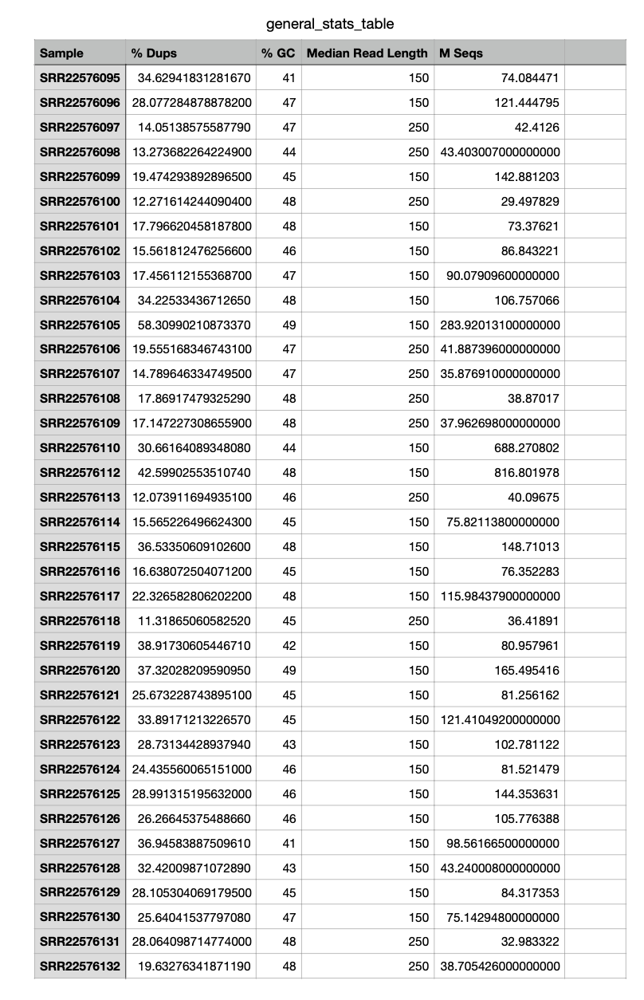
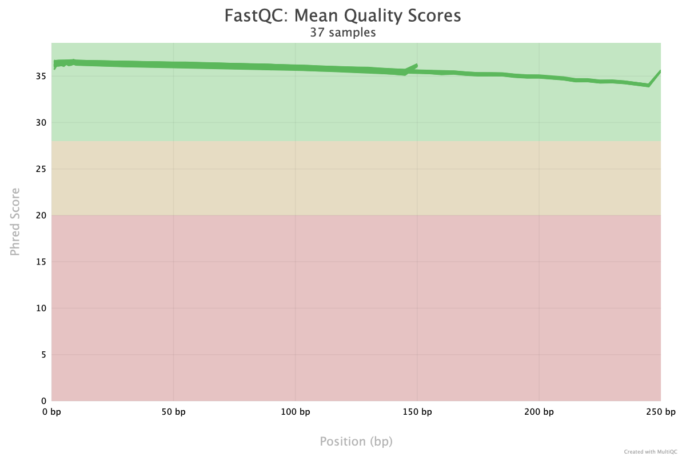

# Host Mitochondrial DNA Extraction from Animal Gut Metagenomic Samples

## Overview
This project focuses on extracting, validating, and characterizing host mitochondrial DNA from gut metagenomic sequencing data. Using African savanna elephant (*Loxodonta africana*) gut samples, a reference-based approach was applied to identify mitochondrial reads embedded within complex microbial metagenomes, followed by assembly, evaluation, and annotation.

All analyses were performed on the UNH RON high-performance computing (HPC) cluster using Illumina short-read sequencing data.

## Project Objectives
- Extract host mitochondrial DNA from gut metagenomic samples  
- Validate mitochondrial DNA presence using reference-based read mapping  
- Attempt mitochondrial genome reconstruction from pooled reads  
- Evaluate assembly characteristics and limitations  
- Annotate mitochondrial gene features  

## Dataset Description
- Publicly available gut metagenomic sequencing data (~38 samples)
- Illumina paired-end short-read sequencing (150–250 bp)
- Tens of millions of reads per sample
- Host DNA present as a minor fraction within microbial metagenomes
- Reference mitochondrial genome: *Loxodonta africana* (NC_000934.1; 16,866 bp)

## Workflow Summary
1. Download SRA sequencing data  
2. Convert and preprocess SRA files  
3. Quality control using FastQC and MultiQC  
4. Adapter and quality trimming using Trimmomatic  
5. Mapping reads to the mitochondrial reference genome using BWA-MEM  
6. Filtering and pooling of mitochondrial alignments  
7. Assembly attempts using SPAdes  
8. Assembly evaluation and annotation  

## Repository Structure
SRA_downaload # Script to download SRA sequencing data
- sra_fasta # Script to convert/process SRA data
- fastqc # FastQC quality control script
- trimmomatic # Read trimming script
- bwa_mem # BWA-MEM mapping script
- bam_to_spades # Script to prepare BAM files for SPAdes assembly
- README.md

Raw sequencing data, intermediate files, and large output directories are intentionally excluded from version control in accordance with best practices.

## Quality Control Results
Quality control analysis showed high-quality Illumina reads across samples. Adapter sequences and low-quality bases were successfully removed during trimming. Post-trimming QC confirmed clean input data suitable for downstream mitochondrial mapping.

## Quality Control Visualization
Representative quality control plots generated using FastQC and MultiQC are shown below. Raw reads exhibited high base quality across most positions, with further improvement observed after adapter and quality trimming.

## Mitochondrial Mapping Results
Reads were mapped to the African elephant mitochondrial reference genome (NC_000934.1). Mapping statistics provided strong evidence for host mitochondrial DNA presence:

- ~899,795 mitochondrial reads retained after filtering  
- 100% of retained reads mapped to the reference  
- ~94% of reads were properly paired  

These results robustly confirm host mitochondrial DNA embedded within gut metagenomic samples.

## Assembly Results
Pooled mitochondrial read assembly produced a single contig of approximately 16.9 kb, consistent with the expected size of the elephant mitochondrial genome. Despite high sequencing depth, assembly continuity was limited by short-read data and uneven coverage, which are known challenges for reconstructing circular mitochondrial genomes from metagenomic samples.

## BUSCO Completeness Assessment
Assembly completeness was explored using BUSCO v5.4.2 with the `eukaryota_odb10` lineage dataset (255 conserved eukaryotic BUSCO genes). BUSCO reported 0% completeness, with all BUSCO genes classified as missing.

This result is expected and biologically appropriate because BUSCO gene sets target conserved **nuclear** genes, whereas mitochondrial genomes encode a limited and distinct gene set. The absence of BUSCO hits therefore reflects the organellar nature of the assembly rather than assembly failure. In this context, BUSCO serves as a diagnostic check confirming the lack of nuclear gene contamination rather than a measure of mitochondrial genome completeness.

## Prokka Annotation
Mitochondrial contigs were annotated using Prokka, which identified gene features consistent with mammalian mitochondrial genomes. Annotation results, together with extensive reference-based read mapping and expected genome length, provided functional validation of host mitochondrial DNA presence. Downstream visualization using Proksee was limited by assembly fragmentation and incomplete consensus reconstruction.

## Limitations
- Short Illumina read lengths (150–250 bp)
- Elevated duplication rates in several samples
- Metagenomic background complexity
- Uneven mitochondrial coverage
- Circular mitochondrial genome structure
- Limited suitability of nuclear completeness metrics for organellar genomes

## Conclusions
Although complete mitochondrial genome reconstruction was constrained by short-read metagenomic data, extensive reference-based read mapping, correct genome length, and successful mitochondrial gene annotation robustly confirm the presence of host mitochondrial DNA in gut metagenomic samples. This study highlights both the feasibility and limitations of extracting host mitochondrial signals from complex metagenomic datasets using short-read sequencing.

## Tools Used
- SRA Toolkit  
- FastQC  
- MultiQC  
- Trimmomatic  
- BWA  
- SAMtools  
- SPAdes  
- BUSCO  
- Prokka  

## Author
**Nikhitha Vujjini**  
M.S. Bioinformatics  

